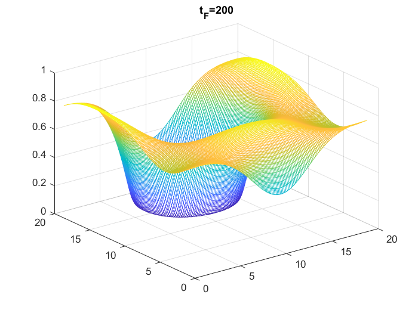

### Thin-Film (TF) equation

These files implement the Biharmonic-Modified approach for
TF equations and variable mobility CH equations.

MATLAB example for BHM method applied to the TF equation-
Code needs I.C in form of a data file and Uexact to compute errors.
Simple modifications to this code will allow users to implement other schemes
of higher order of accuracy which are discussed in the paper. 

### For more details in the schemes please visit: Journal of Computational Materials Science.
### IMEX Methods for TF equations and CH equations with variable mobility.
### Authors: Saulo Orizaga and Thomas Wilteski.

Runnig the code BertozziMethod.m will generate the following plot

Running the code ###TF_5holes_simulation.m### will generate the following plot

