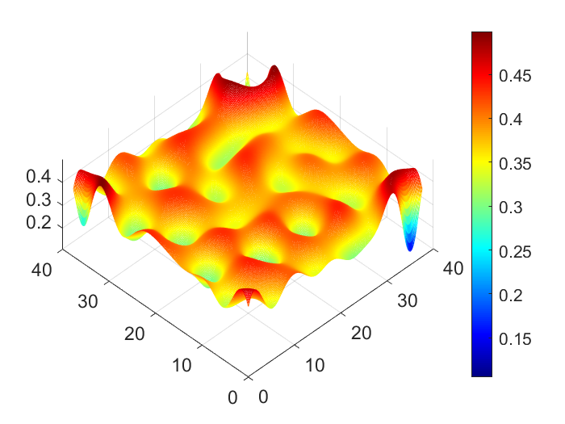

These files implement the Biharmonic-Modified approach for
TF equations and variable mobility CH equations.

MATLAB example for BHM method applied to the TF equation-
Code needs I.C in form of a data file and Uexact to compute errors.
Simple modifications to this code will allow users to implement other schemes
of higher order of accuracy. 

  

  

